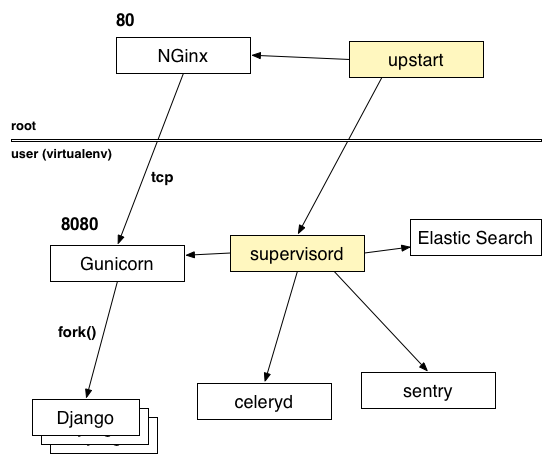
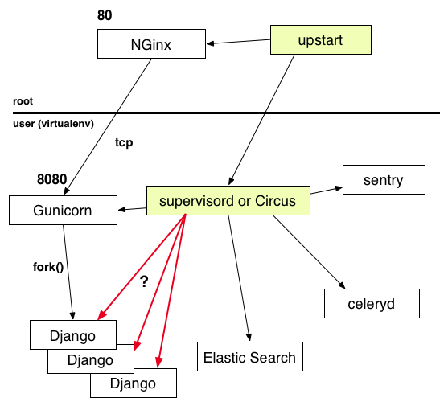
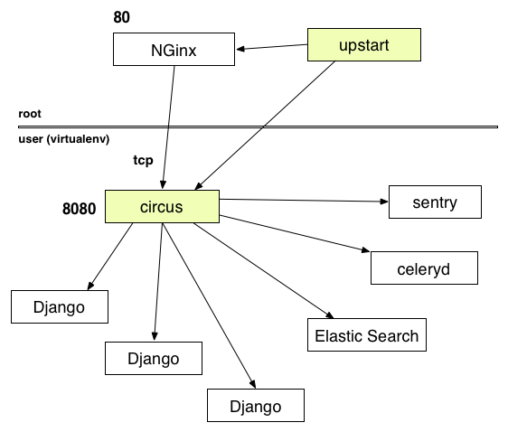

+++++++++++++++++++++++
Circus - Europython '13
+++++++++++++++++++++++

----

.. image:: circus-medium.png

.. class:: center

    **Process & Socket Manager**

    Tarek Ziadé - tarek@mozilla.com - @tarek_ziade

----

Typical deployment
==================

.. image:: django-deployment.png

----

Supervision tools
=================

- **Supervisord** -- Python, pretty cool, APIs: XML-RPC, good community,
  hard to extend, web UI so-so, no real-time stdout.

- **Bluepill** -- flapping, tedious DSL, less mature

- **upstart** -- system level - root access needed

- **daemontools** -- low-level like upstart, not very interactive

- god, monit, runit, etc..

----

Deployment with Supervisor
==========================

----

Missing features
================

- realtime stdout/stderr
- realtime stats
- powerful web console
- remote access
- clustering
- event-based plugins

=> Circus project launched !

----

Technical choices
=================

- process management : **psutil**
- Message passing : **ZeroMQ**
- Web console : **socket.io** & **Bottle** & **Gevent**
- Everything else: Python

----

The Core: psutil
================

- clean & simple API
- fast (speedup fixes > 0.6.1)

.. code-block:: python

   >>> import psutil
   >>> p = psutil.Process(7384)
   >>> p.name
   'Address Book'

   >>> p.create_time
   1346710439.681407

   >>> p.uids
   user(real=501, effective=501, saved=501)

----

The Messenger: ZeroMQ
=====================

- async library for message passing == *smart* socket
- highly scalable
- transports: ITC, IPC, TCP, PGM (multicast)
- principal patterns

 - request/reply
 - pub/sub
 - push/pull

- used by **IPython**
- PyZMQ = zmq bind + nice I/O event loop adapted from Tornado

----

Circus Architecture
===================

.. image:: circus-architecture.png

----

Recap'
------

- **circusd**: daemon that watches all processes
- **circusctl**: CLI controller
- **circus-top**: display processes activity
- **circus-httpd**: web interface (control+display)
- **plugin**: your own event-based plugins, Like **flapping**

----

Circus Example
==============

Config file:

.. code-block:: ini

    [circus]
    httpd = 1
    statsd = 1

    [watcher:django]
    cmd = bin/gunicorn -b 0.0.0.0:8080 my.django.wsgi
    singleton = 1
    working_directory = /var/myapp

    [watcher:retools-workers]
    cmd = bin/retools-worker main
    numprocesses = 5

Launch

.. code-block:: sh

  $ circusd webapp.ini

----

circusctl Interactive Shell
---------------------------

.. code-block:: bash

    $ circusctl
    circusctl 0.7.1
    django: active
    retools-workers: active

    (circusctl) help

    Documented commands (type help <topic>):
    ========================================
    add     get            list         numprocesses  quit     rm      start   stop
    decr    globaloptions  listen       numwatchers   reload   set     stats
    dstats  incr           listsockets  options       restart  signal  status

    (circusctl) numprocesses retools-workers
    5

    (circusctl) incr retools-workers
    6

----

circus-top
----------

.. code-block:: bash

        Circus Top
        ------------------------------------------------------------------------
        retools-workers
        PID                      CPU (%)             MEMORY (%)          AGE (s)
        54723                      0.00                0.40                29.61
        54725                      0.00                0.40                29.60
        54724                      0.00                0.40                29.60
        54726                      0.00                0.40                29.59
        54727                      0.00                0.40                29.58
                                   0.00 (avg)          2.00 (sum)          29.61 (older)

        django
        PID                      CPU (%)             MEMORY (%)          AGE (s)
        54728                      0.00                0.30                29.58
                                   0.00 (avg)          0.30 (sum)          29.58 (older)

        circus
        PID                      CPU (%)             MEMORY (%)          AGE (s)
        54722 (circusd-stats)      1.90                0.40                29.64
        54721 (circusd)            0.10                0.20                29.64
                                   1.00 (avg)          0.60 (sum)          29.64 (older)

        ------------------------------------------------------------------------

----

circus-httpd
============

----

Go son, deploye yer apps
========================

.. image:: devops.jpg

----

2 levels of supervision
=======================

----

Circus sockets
==============

Like Apache or Gunicorn - **pre-fork model**:

- Every process managed by Circus is forked from **circusd**
- **circusd** creates & open sockets
- child processes can *accept()* connection on those sockets
- system-level load balancing

----

WSGI apps & Circus Sockets
==========================

- **Chaussette** : WSGI server that reuses already opened sockets
- Launched with the socket file descriptor number
- the socket object is recreated with *socket.fromfd()*
- several backends: gevent, meinheld, waitress, wsgiref, eventlet

=> http://chaussette.readthedocs.org

----

Circus-based stack
==================

----

Example
=======

.. code-block:: ini

    [circus]
    ..

    [socket:webapp]
    host = 127.0.0.1
    port = 8080

    [watcher:django-worker]
    cmd = chaussette --fd $(circus.sockets.webapp) project.wsgi.application
    use_sockets = True
    numprocesses = 2

    [env:django-worker]
    PYTHONPATH = /path/to/parent-of-dproject

    [watcher:retools-workers]
    cmd = bin/retools-worker main
    numprocesses = 5

----

Benchmarks
==========

Faster to slowest:

- Circus + gevent
- Circus + meinheld
- Gunicorn + gevent
- Circus + waitress

c.f. http://tinyurl.com/cykvgmo

----

Features being added
====================

- Clustering
- stderr/stdout streaming in the web dashboard
- ...

----

Thanks !
========

Questions ?

- Docs: http://circus.rtfd.org
- IRC: #mozilla-circus on Freenode
- ML : http://tech.groups.yahoo.com/group/circus-dev
- Code: https://github.com/mozilla-services/circus

