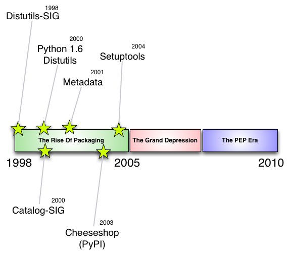
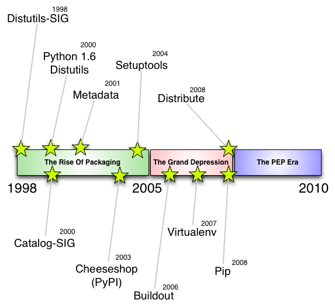
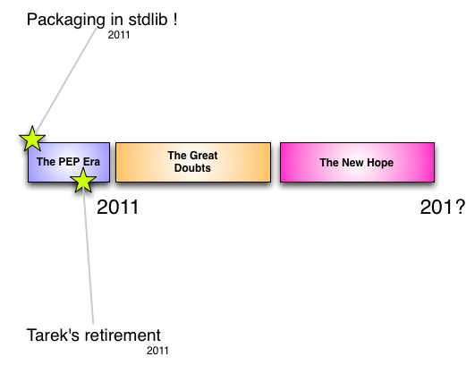
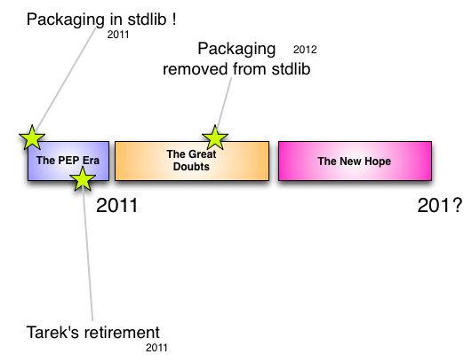
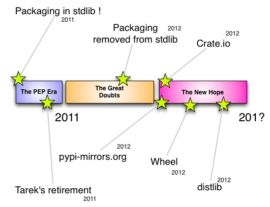

The State Of Packaging
======================

Tarek Ziade - @tarek_ziade - http://ziade.org

----

25,694
------

----

258,014,251
------------

----

vibrant ecosystem.
------------------

----

messy. frustrating. confusing.
------------------------------

.. image:: confused.gif

----

----

----

.. image:: history-3.png

----

----

----

Packaging removed from Py3
--------------------------

.. image:: thumbs_down.gif

----

ah. well.
---------

.. image:: facepalm.gif

----

----

The PEP Era - standards FTW
---------------------------

----

- working proof of concept
- dev
- TRUNKdev-r5
- unreleased.unofficialdev
- 1.0dev-BZR-r45-panta-elasticworld.org-20091021145839-1oceeh3stpvyl04t
- 1.01b1+encoding_patch+removed_django_depends
- 0.19 "Nose Furnace"
- (tip)
- Pre-Alpha

----

PEP 386 - MAJOR.MINOR[.MICRO]...
--------------------------------

----

PEP 376 - Standard installation
-------------------------------

----

PEP 345 - project-level dependencies
------------------------------------

----

PEP 381 - PyPI Mirrors
----------------------

::

  $ pip --use-mirrors

----

What's next ?
-------------

**I dont' know...**

.. image:: bear.gif

----

More details
------------

Read http://aosabook.org/en/packaging.html

----

5 packaging tips
----------------

----

Tip # 1 -- Use a PEP 386 compatible scheme for your versions
------------------------------------------------------------

----

Tip #2 -- setup.py should be as dumb and simple as possible
-----------------------------------------------------------

----

Tip #3 -- Do not make any assumption on the installer that'll be used
---------------------------------------------------------------------

----

Tip #4 -- Do not release unstable releases at pypi
--------------------------------------------------

----

Tip #5 -- Be cautious about your data files
-------------------------------------------

----

5 deployment tips
-----------------

----

Tip #6 -- Use Pip,  but the OS packaging system prevails.
---------------------------------------------------------

----

Tip #7 -- Use virtualenv, but the OS packaging system prevails
--------------------------------------------------------------

----

Tip #8 - pin your dependencies recursively
------------------------------------------

----

Tip #9 - Do not depend on PyPI for deployments
----------------------------------------------

----

Thanks !
========

Questions ?

