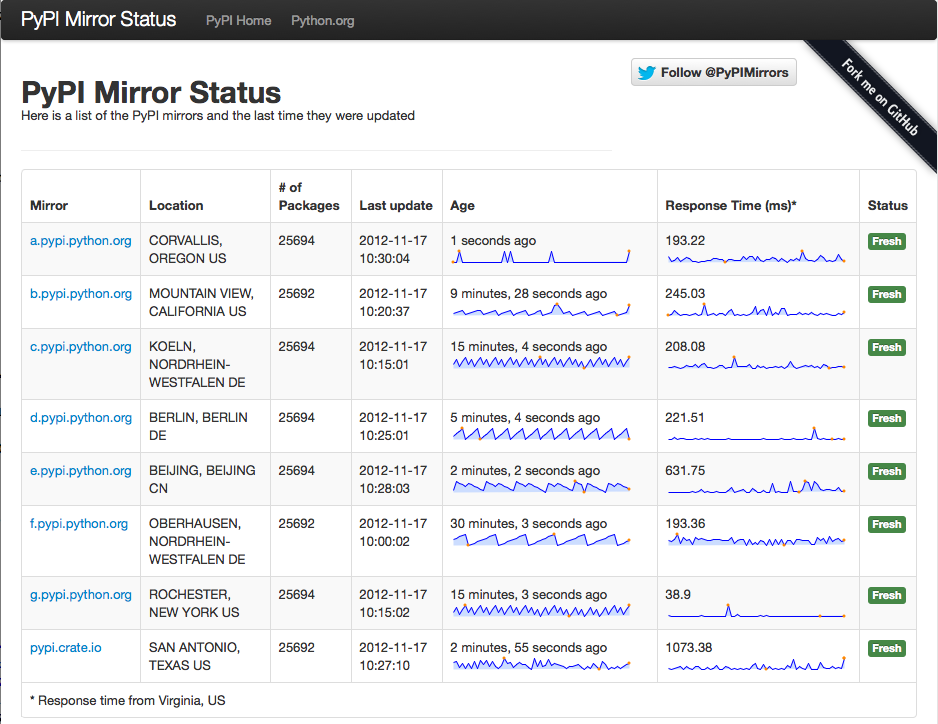
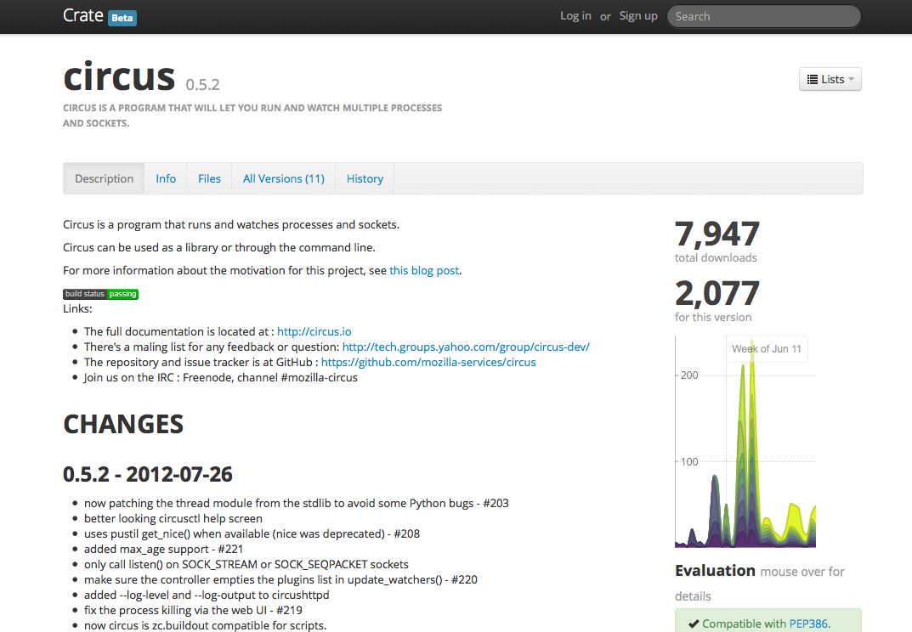

The State Of Packaging
======================

Tarek Ziade - @tarek_ziade - http://ziade.org

----

vibrant ecosystem.
------------------

- 25,694 projects
- 258,014,251 downloads

----

messy. frustrating. confusing.
------------------------------

.. image:: confused.gif

----

.. image:: history-1.png

----

.. image:: history-2.png

----

.. image:: history-3.png

----

.. image:: history-4.png

----

.. image:: history-5.png

----

Packaging removed from Py3
--------------------------

.. image:: thumbs_down.gif

----

ah. well.
---------

.. image:: facepalm.gif

----

.. image:: history-6.png

----

----

----

What's next ?
-------------

**I dont' know...**

.. image:: bear.gif

----

More details
------------

Read http://aosabook.org/en/packaging.html

----

5 packaging tips
----------------

----

# 1 -- Use a PEP 386 compatible scheme for your versions
--------------------------------------------------------

----

#2 -- setup.py should be as dumb and simple as possible
-------------------------------------------------------

----

#3 -- Do not make any assumption on the installer that'll be used
-----------------------------------------------------------------

----

#4 -- Do not release unstable releases at PyPI
----------------------------------------------

----

#5 -- Be cautious about your data files
---------------------------------------

----

4 deployment tips
-----------------

----

#1 -- Use Pip,  but the OS packaging system prevails.
-----------------------------------------------------

----

#2 -- Use virtualenv, but the OS packaging system prevails.
-----------------------------------------------------------

----

#3 - pin all your dependencies (recursively)
--------------------------------------------

----

#4 - Do not depend on PyPI for deployments
------------------------------------------

----

Thanks !
========

Questions ?

