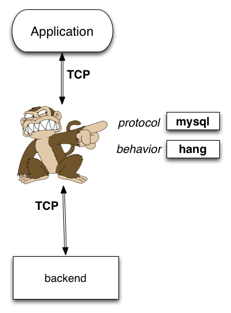
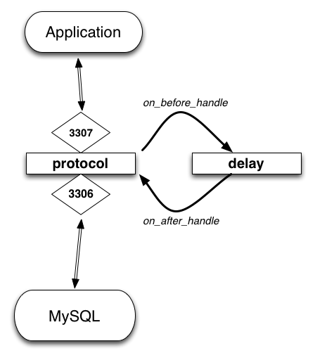
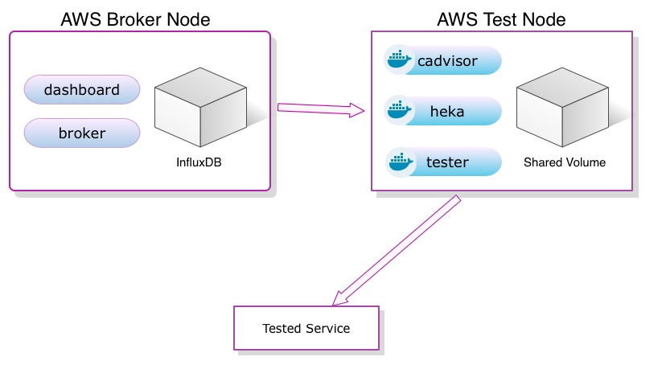

+++++++++++++++
Vaurien & Loads
+++++++++++++++

----

.. image:: monkey.png

.. class:: center

    **Break all things**

    Tarek Ziade - tarek@mozilla.com - @tarek_ziade

----

Netflix
-------

  | Chaos Monkey is a service which identifies groups of systems and randomly
  | terminates one of the systems in a group

----

Building apps in theory
-----------------------

Natural web server cycle:

1. dev server
2. stage server - load testing, QA etc
3. production server - everything's smooth

----

...in practice
--------------

Something will break in the TCP stack in production at some point no matter what.

.. image:: atomic.gif

----

Real life example 1/2
---------------------

.. code-block:: python

   socket.send(data)

*Applications are responsible for checking that all data has been
sent; if only some of the data was transmitted, the application needs to
attempt delivery of the remaining data.*

----

Real life example 2/2
---------------------

**The right pattern:**

.. code-block:: python

    total = 0
    while total < len(data):
        sent = self.sock.send(data[total:])
        if sent == 0:
            raise RuntimeError("socket connection broken")
        total += sent

**Or simply:**

.. code-block:: python

   socket.sendall(data)

----

Other common failures
---------------------

- **Lost connection to MySQL server**
- **Timeout Error**
- **Too many connections**
- **Too many open files**
- **Too many Caïpirinha**

----

Why it still happens all the time
---------------------------------

- Testing  the I/O is often ignored
- Manual testing is tedious
- Automating failures realistically is hard

.. image:: confused.gif

----

Vaurien
-------

**TCP failures simulation tool**

----

Vaurien Design
--------------

----

Protocol & behaviors
--------------------

----

Built-in protocols & behaviors
------------------------------

- protocols: http, memcache, mysql, redis, smtp, generic tcp
- behaviors: blackout, delay, dummy, error, hang

Create your own.

----

Command line
------------

An SSL SMTP proxy with a 5% error rate and 10% delays

.. code-block:: bash

   $ pip install vaurien
   $ vaurien --proxy 0.0.0.0:6565 --backend mail.example.com:465 \
             --protocol smtp --behavior 5:error,10:delay

MySQL with 5% hangs :)

.. code-block:: bash

   $ vaurien --proxy 0.0.0.0:3307 --backend localhost:3306
             --protocol mysql --behavior 5:hang

----

Config file
-----------

.. code-block:: ini

    [vaurien]
    backend = google.com:80
    proxy = localhost:8000
    protocol = http
    behavior = 20:delay

    [behavior:delay]
    sleep = 2

And then:

.. code-block:: bash

   $ vaurien --config vaurien.ini

----

Unit tests
----------

.. code-block:: python

    import unittest
    from vaurien import Client, start_proxy, stop_proxy

    class MyTest(unittest.TestCase):

        def setUp(self):
            self.proxy_pid = start_proxy(port=8080)

        def tearDown(self):
            stop_proxy(self.proxy_pid)

        def test_one(self):
            client = Client()
            options = {'inject': True}

            with client.with_behavior('error', \\**options):
                # do something...
                pass

            # we're back to normal here

----

Writing a behavior
------------------

A simple class:

.. code-block:: python

    from vaurien.behaviors.dummy import Dummy
    import time

    class Delay(Dummy):
        name = 'delay'
        options = {'sleep': ("Delay in seconds", int, 1)}
        options.update(Dummy.options)

        def on_before_handle(self, protocol, source, dest, to_backend):
            time.sleep(self.option('sleep'))
            return True

        def on_after_handle(self, protocol, source, dest, to_backend):
            pass

----

Writing a protocol
------------------

.. code-block:: python

    from vaurien.protocols.base import BaseProtocol

    class MinitelProtocol(TCP):
        name = 'minitel'

        def _handle(self, source, dest, to_backend):
            # source = source socket
            # dest = destination socket
            # to_backend = direction
            ... implement a protocol ...

----

Used for Firefox Marketplace
----------------------------

Read http://tinyurl.com/marketplace-test

----

Loads - Distributed Load testing
--------------------------------

----

Plain functional tests
----------------------

Write functional tests and they're used as load tests.

You can use Requests APIs or WebTest APIs to do the calls.

Example::

    from loads.case import TestCase

    class TestWebSite(TestCase):
        def test_es(self):
            res = self.session.get('http://localhost:9200')
            self.assertEqual(res.status_code, 200)

----

Test locally
------------

Then there's a simple command line to run the test::

    $ loads-runner example.TestWebSite.test_es
    [===============================================]  100%

    Hits: 1
    Duration: 0.03 seconds
    Approximate Average RPS: 39
    Average request time: 0.01s

    Success: 1
    Errors: 0
    Failures: 0

----

Test WebSockets
---------------

the ws4py lib is wrapped in::

    from loads.case import TestCase

    class TestWebSite(TestCase):

        def test_something(self):

            results = []

            def callback(m):
                results.append(m.data)

            ws = self.create_ws('ws://localhost:9000/ws',
                                callback=callback)
            ws.send('something')
            ws.receive()
            ws.send('happened')
            ws.receive()

            while len(results) < 2:
                time.sleep(.1)

            self.assertEqual(results, ['something', 'happened'])

----

Distributed architecture
------------------------

.. image:: loads.png

----

Run a distributed test
----------------------

You can run the test on several nodes using a Loads cluster
and run tests across them. Example across 5 agents::

    $ load-runner example.TestWebSite.test_something --agents 5

Everything is coming back in real time and you can stop it whenever
you want.

----

Limits and Caveats
------------------

- broker bottleneck
- zmq and network splits

----

Loadsv2!
--------

- Based on Docker containers
- based on statsd
- Each node is independant
- InfluxDB
- Grafana

----

----

Loadsv2
-------

- the test script can be whatever
- will provide loadsv1 nice functional test UX
- Work in progress!
- ETA 0.1: December

----

Thanks !
--------

Questions ?

- Vaurien Docs: http://vaurien.rtfd.org
- Vaurien Code: https://github.com/mozilla-services/vaurien
- Loads Docs: http://loads.readthedocs.org
- Loadsv1 Code : https://github.com/mozilla-services/loads

