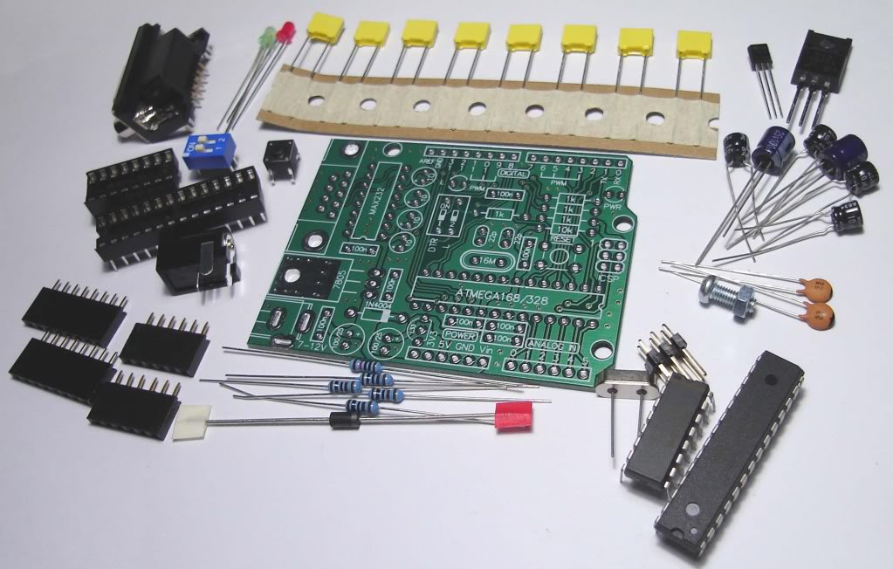
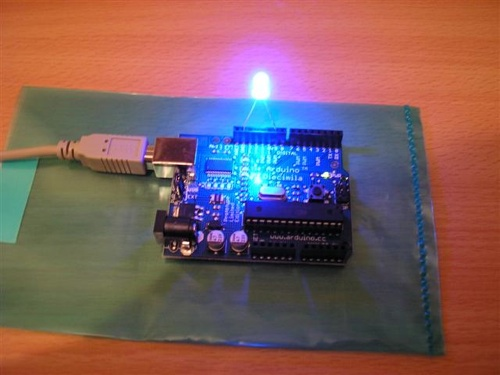
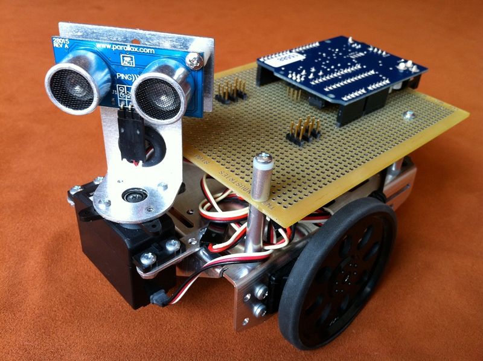
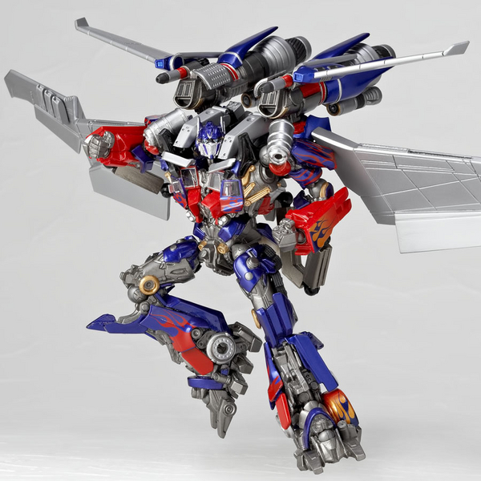
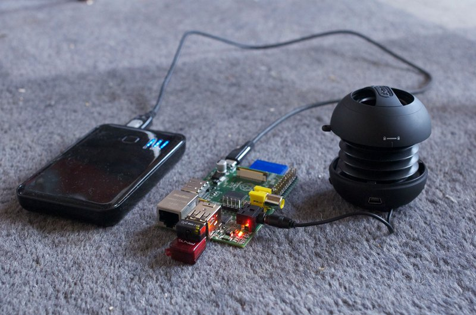

++++++++++++++++++++++++++++++
R-Pi & Arduino - Pycon Fr 2012
++++++++++++++++++++++++++++++

----

.. class:: center

    **Raspberry Pi & Arduino**

    * Tarek Ziade - tarek@ziade.org - @tarek_ziade
    * Johnatan Schemoul - jonathan.schemoul@hackspark.fr - @jon1012

----

Arduino
=======

.. image:: arduino_uno_test.jpg

**plateforme de prototypage open source**

----

Arduino
=======

----

Arduino
=======

.. image:: arduixp.jpg

----

Arduino
=======

----

Arduino
=======

----

Arduino
=======

----

Arduino
=======

- 16 Mhz
- 8 bits
- 32k Flash
- 2k RAM

----

Arduino
=======

- livre - Beginning with Arduino
- adafruit

----

Arduino
=======

Projet Voiture RC

`Video <https://plus.google.com/photos/106436370949746015255/albums/5765433351974598417/5765433358865484370>`_

----

stm32f4
=======

- STM32F4
- ARM
- 32 Bits

----

stm32f4
=======

- 168 Mhz
- 32 Bits
- STM32F4 Discovery
- 3xADC, DAC, Accéléromètre
- Python...
    

----

stm32f4
=======

    Python ?
        - Atelier hier de 14 à 18h
        - Codé en Python directement
        - Avancée sur le DAC, sur un driver lcd en python

----

Raspberry-PI
============

.. image:: raspi_blue_white.png

----

Raspberry-PI
============

Specs:

- Broadcom BCM2835
- 700 mhz ARM CPU
- composite, USB, HDMI, audio out, ethernet

----

R-PI et Python
==============

- Des GPIOs...
- Avec WiringPi
    - En C
    - Simple
    - Bindings Python
    

----

Raspberry Jukebox
=================

----

Raspberry-PI
============

    projet lcd graphique => https://www.youtube.com/watch?v=nMQJmVDgAl8   [jon]

XXX

----

Thanks !
========

Questions ?

