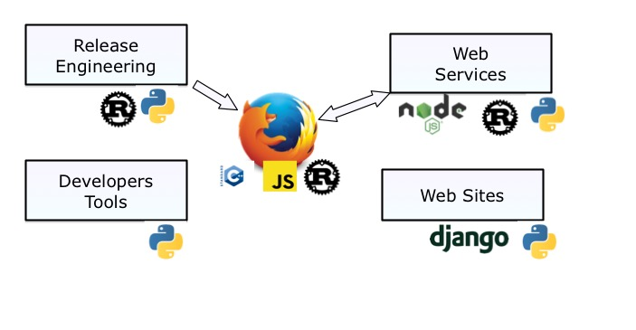

Pycon Ireland
+++++++++++++

----

Mozilla & Python
----------------

.. class:: center

    Tarek Ziade - tarek@mozilla.com - @tarek_ziade

----

.. image:: raglan01.jpg

----

Firefox Ecosystem
-----------------

.. image:: FirefoxEcosystem.jpg

----

Languages in 2009
-----------------

----

Language trend
--------------

*Tired*

- **Perl**
- **PHP**

*Wired*

- **Python**  OMG Django, batteries included, but packaging ? cmon
- **Node.js** OMG it's async it's JS it's faster
- **Go** Look it's just one binary, the logo is so cool
- **Rust** WOW it's secure

----

Languages in 2016
-----------------

----

Web Sites in Python
-------------------

Mostly Django:

- addons.mozilla.org (AMO)
- developer.mozilla.org (MDN)
- reps.mozilla.org
- mozilla.org
- mozillians.org, moderator.mozilla.org, ...

----

Web Services in Python
----------------------

- **Firefox Sync**: Cornice, Pyramid
- some of **Firefox Account**: Cornice, Pyramid
- **Socorro** (Crash Stats): SQLALchemy
- **Web Push**: Twisted (v2)

----

Release Engineering
-------------------

- command-line scripts
- **Balrog**: Web services + Django web admin
- **Ship-it**: Flask, SQLALchemy
- **Treeherder**: build dashboard (Django)
- **Pulse Guardian**: Kombu/RabbitMQ

----

Developer tools
---------------

- **mach**: vanilla Python (CLI)
- **mozreview**: tweaked ReviewBoard (Django)
- **MozTrap**: Test case Management (Django)
- **Loads**: Distributed load testing (Tornado)

----

What's next at Mozilla ?
------------------------

- MozPoll ~ 121 answers
- 50% use Python as primary language
- 90% used Python in the past 6 months

----

As a Developer...
-----------------

Why do you like Python ?

1. Readability
2. Rich ecosystem
3. Simplicity

Why do you hate Python ?

1. Python 2 vs Python 3 "mess"
2. Packaging
3. Not statically typed

----

----

.. image:: websites.png

----

----

The Story of WebPush
--------------------

Go is so much faster than Python. Python is bad at handling a lot of
connections. Let's use Go, like Urban Airship does.

----

Webpush v1
----------

- Go v1.2

  - memory hog for socket based apps (better in 1.4)
  - error managment a pain
  - live debugging a pain (gdb, printf FTW)
  - goroutine channels leaks
  - testing is tedious (needs interfaces)
  - 65% code coverage

----

Webpush v2
----------

- Python 2.7 and Twisted

  - full replacement in 4 days!
  - way less memory usage
  - async coding under control
  - PyPy is almost as fast as Go
  - CPython has improved a lot

----

.. image:: system.png

----

Rust
----

- Faster execution ++
- So much nicer to write than C
  - no memory allocation mess
  - single mutator
- Ecosystem starting to emerge
- Cargo ++
- Shipping binaries is nice
- Easy to use from Python (cffi)

----

Forecast
--------

----

.. image:: wordcloud.png

