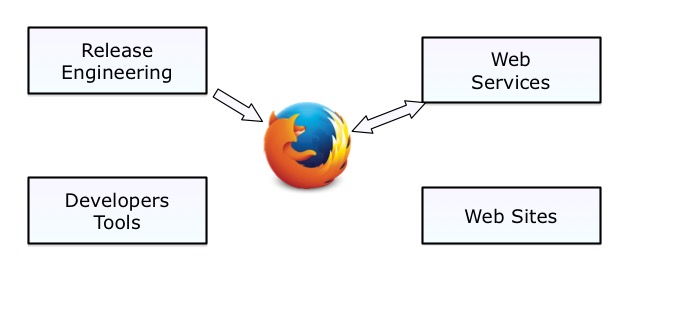
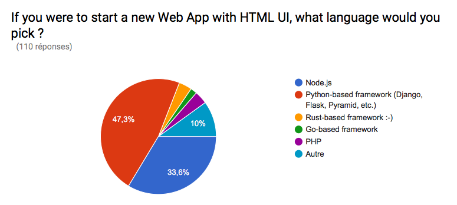
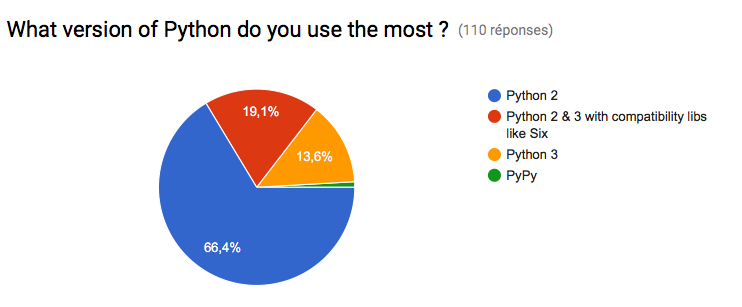
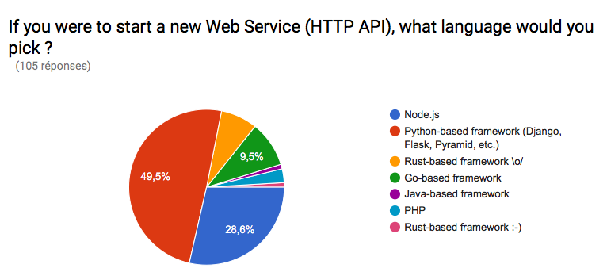
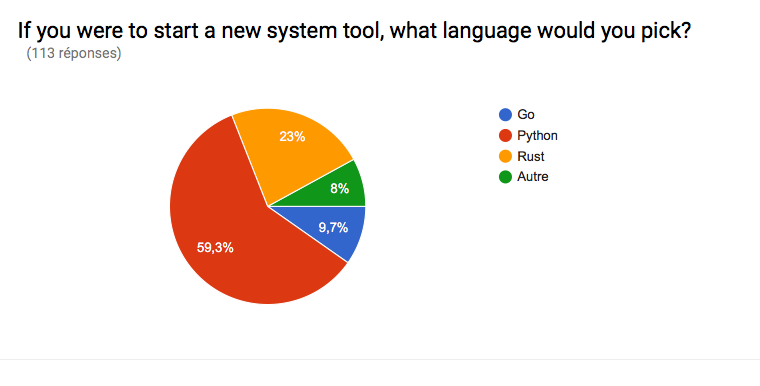

Pycon MY 2016
+++++++++++++

----

.. class:: center

    **Python, the not-so-secret weapon at Mozilla**

    Tarek Ziade - tarek@mozilla.com - @tarek_ziade

----

Selamat datang ke Pycon. Terima kasih kerana mempunyai saya

----

----

Firefox is more than a browser

----

Mozilla paid staff
------------------

- Foundation
- IT
- Connected Devices (ex-Firefox OS)
- Firefox
- Platform
- Ops
- Marketing
- ...

----

----

MozPoll
-------

- 121 answers
- Firefox (50%), Platform (25%), Connected Devices (12.5%)
- 50% use Python as primary language
- 90% used Python in the past 6 months

----

Web Sites
---------

Why Python ?

1. Django (as a PHP replacer)
2. Django (community, ecosystem <3)
3. Django (because Python)

----

Web Sites
---------

Django pain points:

1. Building monolithic apps is super easy
2. Build slow views is easy\*

\*We became ElasticSearch experts :)

----

Web Sites in Python
-------------------

- addons.mozilla.org (AMO)
- developer.mozilla.org (MDN)
- reps.mozilla.org
- mozilla.org
- mozillians.org, moderator.mozilla.org, ...

----

----

AMO
---

- One of the highest trafficked site
- CakePHP => Django
- SVN => git

----

Web Services
------------

Why Python ?

1. Readability
2. Rich ecosystem
3. Simplicity

----

Web Services
------------

Python pain points:

1. Python 2 vs Python 3 "mess"
2. Packaging
3. Not statically typed

----

----

----

Web Services in Python
----------------------

- Firefox Sync
- Firefox Account (partially)
- Socorro (Crash Stats)
- Web Push

----

The Story of WebPush

----

Go is so much faster than Python.
Python is bad at handling a lot of connections.
Let's use Go, like Urban Airship does.

----

- Go v1.2

  - memory hog for socket based apps (better in 1.4)
  - error managment a pain
  - live debugging a pain (gdb, printf FTW)
  - goroutine channels leaks
  - testing is tedious (needs interfaces)
  - 65% code coverage

----

- Python 2.7 and Twisted

  - full replacement in 4 days!
  - way less memory usage
  - async coding under control
  - PyPy is almost as fast as Go
  - CPython has improved a lot

----

Release Engineering
-------------------

- Balrog: Web services + Django web admin
- Ship-it: Flask, SQLALchemy
- Treeherder: build dashboard (Django)
- Pulse Guardian: Kombu/RabbitMQ

----

Developer tools
---------------

- mach: vanilla Python (CLI)
- mozreview: tweaked ReviewBoard (Django)
- MozTrap,: Test case Management (Django)
- Loads: Tornado

----

----

Conclusion
----------

- The Node.js revolution did not really happen.
- Python has a grat future at Mozilla
- Rust is coming  <3

----

Mozilla Language Forecast
-------------------------

- System scripts: Go => Rust, Python
- Web services: Rust, Python with asyncio (Python 3 then PyPy)
- Web Sites: Django (until the next CMS revolution)

----

Itu sahaja.

----

